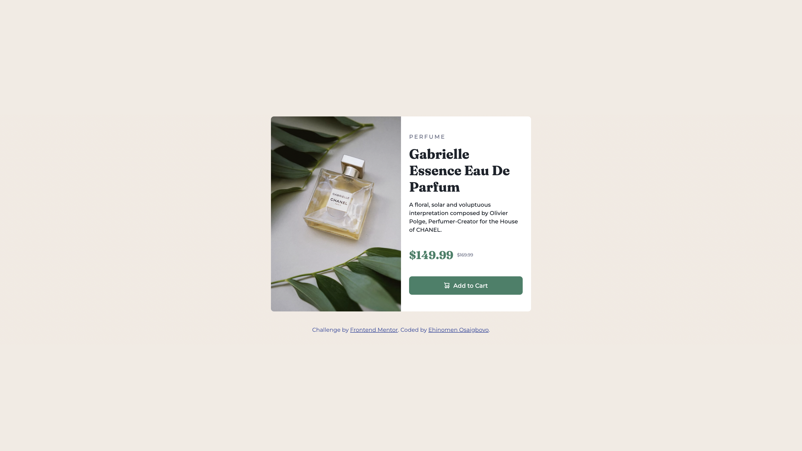

# Frontend Mentor - Product preview card component solution

This is a solution to the [Product preview card component challenge on Frontend Mentor](https://www.frontendmentor.io/challenges/product-preview-card-component-GO7UmttRfa). Frontend Mentor challenges help you improve your coding skills by building realistic projects. 

## Table of contents

- [Overview](#overview)
  - [The challenge](#the-challenge)
  - [Screenshot](#screenshot)
  - [Links](#links)
- [My process](#my-process)
  - [Built with](#built-with)
  - [What I learned](#what-i-learned)
  - [AI Collaboration](#ai-collaboration)
- [Author](#author)


## Overview

### The challenge

Users should be able to:

- View the optimal layout depending on their device's screen size
- See hover and focus states for interactive elements

### Screenshot



### Links

- Solution URL: [https://www.frontendmentor.io/solutions/responsive-product-card-using-flexbox-SguLVf7B]
- Live Site URL: [https://ehi-frontend-mentor-product-card.netlify.app/]

## My process

### Built with

- Semantic HTML5 markup
- CSS custom properties
- Flexbox
- Mobile-first workflow

### What I learned

Building this product preview card taught me several key concepts:

**Mobile-first responsive design**
I started with the mobile layout and used a `min-width` media query to progressively enhance the desktop layout. This approach ensures the core content is solid before adding complexity.

```css
/* Base mobile styles */
.product__wrapper {
  max-width: 37.5rem;
}

/* Desktop enhancement */
@media (min-width: 43.75em) {
  .product__wrapper {
    display: flex;
    flex-direction: row;
    max-width: 70rem;
  }
}
```

Using CSS variables made managing the color palette and typography much easier. I could define colors once in `:root` and reference them throughout the stylesheet.

Flexbox made it straightforward to create both the stacked mobile layout and the two-column desktop layout. I used `justify-content: space-between` in the card to push the button to the bottom.

**The `<picture>` element**
Using the picture element with a `<source>` tag allowed me to serve different images for mobile and desktop, improving performance and visual quality.

I learned that:
- Image paths starting with `/` are absolute (from domain root), while paths without `/` are relative to the current directory
- Font variables need to match the actual font type (Fraunces is serif, Montserrat is sans-serif)

### AI Collaboration

I used an AI assistant to help guide me through this project. Here's how it went:

The AI helped explain CSS concepts like `overflow: hidden`, flexbox alignment, and responsive design patterns when I was stuck.
Getting clear explanations of why certain CSS properties work the way they do helped me understand the underlying concepts.


## Author

- Github - [Ehicodes](https://github.com/Ehicodes)
- Frontend Mentor - [@Ehicodes](https://www.frontendmentor.io/profile/@Ehicodes)
- X - [@Ehinomen_01](https://x.com/Ehinomen_01)


